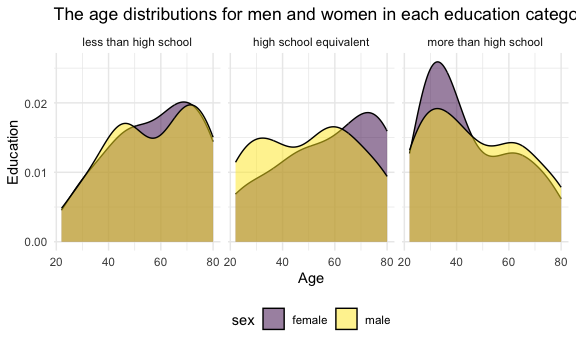
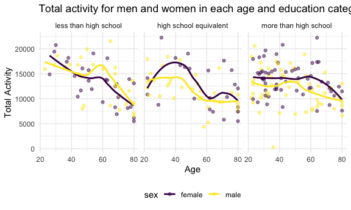
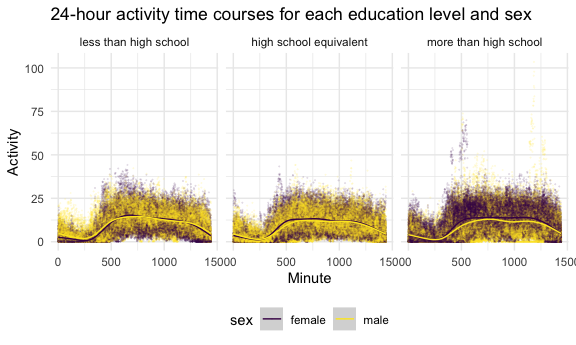

p8105_hw3_hc3448
================
HsiYu Chen
2024-10-13

## Problem 2

``` r
accel_df =
  read_csv("data/nhanes_accel.csv") |> 
  janitor::clean_names()
```

    ## Rows: 250 Columns: 1441
    ## ── Column specification ────────────────────────────────────────────────────────
    ## Delimiter: ","
    ## dbl (1441): SEQN, min1, min2, min3, min4, min5, min6, min7, min8, min9, min1...
    ## 
    ## ℹ Use `spec()` to retrieve the full column specification for this data.
    ## ℹ Specify the column types or set `show_col_types = FALSE` to quiet this message.

``` r
covar_df =
  read_csv("data/nhanes_covar.csv", skip = 4) |> 
  janitor::clean_names() |>
  filter(age > 21) |>
  mutate(
    sex = 
      case_match(
        sex, 
        1 ~ "male", 
        2 ~ "female"
    ),
    sex = as.factor(sex), 
    education =
      case_match(
        education,
        1 ~ "less than high school",
        2 ~ "high school equivalent",
        3 ~ "more than high school"
    ),
    education = factor(education, levels = c("less than high school", 
                                             "high school equivalent", 
                                             "more than high school"))) |>
  drop_na()
```

    ## Rows: 250 Columns: 5
    ## ── Column specification ────────────────────────────────────────────────────────
    ## Delimiter: ","
    ## dbl (5): SEQN, sex, age, BMI, education
    ## 
    ## ℹ Use `spec()` to retrieve the full column specification for this data.
    ## ℹ Specify the column types or set `show_col_types = FALSE` to quiet this message.

``` r
nhanes_df = 
  left_join(covar_df, accel_df, by = "seqn")
```

### Age distributions for men and women in each education category

``` r
nhanes_df |> 
  group_by(sex, education) |> 
  summarize(
    count = n()) |> 
  pivot_wider(
    names_from = sex,
    values_from = count) |> 
  knitr::kable() 
```

    ## `summarise()` has grouped output by 'sex'. You can override using the `.groups`
    ## argument.

| education              | female | male |
|:-----------------------|-------:|-----:|
| less than high school  |     28 |   27 |
| high school equivalent |     23 |   34 |
| more than high school  |     59 |   54 |

There are more participants whose education are more than high school.
Except for the category “high school equivalent”, which has more male
participants, the other two categories have similar numbers of males and
females.

``` r
plot_age_education = 
  nhanes_df |>
  ggplot(aes(x = age, fill = sex)) + 
  geom_density(alpha = 0.5) +
  facet_grid(. ~ education) +
  labs(title = "The age distributions for men and women in each education category",
       x = "Age", y = "Education")

plot_age_education
```


From the plot we can see a more detailed distribution compared to the
table. For example, more older people in this dataset have the education
level as “less than high school”, and more people (and more female)
around age 25-50 have education level as “more than high school”.

``` r
nhanes_df = 
nhanes_df |>
  mutate(total_activity = rowSums(select(nhanes_df, starts_with("min"))))
```

``` r
plot_tot_acitivity =
  nhanes_df |>
  ggplot(aes(x = age, y = total_activity, color = sex)) +
  geom_point(alpha = 0.5) +
  geom_smooth(se = FALSE) +
  facet_grid(. ~education) +
  labs(title = "Total activity for men and women in each age and education category",
       x = "Age",
       y = "Total Activity")
plot_tot_acitivity
```

    ## `geom_smooth()` using method = 'loess' and formula = 'y ~ x'


The plot shows that there are overall decrease in total activity when
age increase. The decrease pattern is more obvious when the education
level is lower. In both “high school equivalent” and “more than high
school” groups, females have higher total activity than males.

``` r
inspection_activity_df =
  nhanes_df |>
  pivot_longer(cols = starts_with("min"),
               names_to = "minute",
               names_prefix = "min",
               values_to = "activity") |>
  group_by(minute, sex, education) |>
  summarize(min_activity = mean(activity)) |>
  mutate(minute = as.numeric(minute))
```

    ## `summarise()` has grouped output by 'minute', 'sex'. You can override using the
    ## `.groups` argument.

``` r
plot_inspection_activity = inspection_activity_df |>
  ggplot(aes(x = minute, y = min_activity, color = sex)) +
  geom_point(alpha = 0.1) +
  geom_smooth() +
  facet_grid(. ~education) +
  labs(title = "24-hour activity time courses for each education level and sex", 
       x = "Minute",
       y = "Activity") 

plot_inspection_activity
```

    ## `geom_smooth()` using method = 'gam' and formula = 'y ~ s(x, bs = "cs")'


Overall, the female has higher average activity than male. Over the day,
the trend is similar. Most people have low average activity at minutes
0-500 and 1250-1500, which would be the normal sleeping time for most
people. As for the difference for the three plots, people with the
education level as less than high school has higher activity during
worktime (morning till early afternoon) whereas the other two categories
has similar acitvity during wake time (the whole day).

## Problem 3
