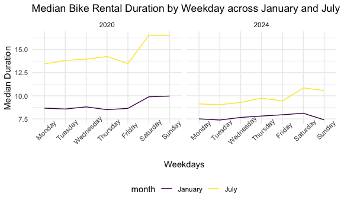
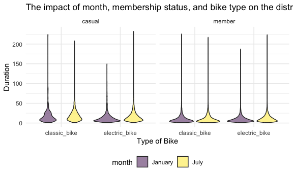

p8105_hw3_hc3448
================
HsiYu Chen
2024-10-13

## Problem 2

``` r
accel_df =
  read_csv("data/nhanes_accel.csv") |> 
  janitor::clean_names()

covar_df =
  read_csv("data/nhanes_covar.csv", skip = 4) |> 
  janitor::clean_names() |>
  filter(age > 21) |>
  mutate(
    sex = 
      case_match(
        sex, 
        1 ~ "male", 
        2 ~ "female"
    ),
    sex = as.factor(sex), 
    education =
      case_match(
        education,
        1 ~ "less than high school",
        2 ~ "high school equivalent",
        3 ~ "more than high school"
    ),
    education = factor(education, levels = c("less than high school", 
                                             "high school equivalent", 
                                             "more than high school"))) |>
  drop_na()

nhanes_df = 
  left_join(covar_df, accel_df, by = "seqn")
```

### Age distributions for men and women in each education category

``` r
nhanes_df |> 
  group_by(sex, education) |> 
  summarize(
    count = n()) |> 
  pivot_wider(
    names_from = sex,
    values_from = count) |> 
  knitr::kable() 
```

    ## `summarise()` has grouped output by 'sex'. You can override using the `.groups`
    ## argument.

| education              | female | male |
|:-----------------------|-------:|-----:|
| less than high school  |     28 |   27 |
| high school equivalent |     23 |   34 |
| more than high school  |     59 |   54 |

There are more participants whose education are more than high school.
Except for the category “high school equivalent”, which has more male
participants, the other two categories have similar numbers of males and
females.

``` r
plot_age_education = 
  nhanes_df |>
  ggplot(aes(x = age, fill = sex)) + 
  geom_density(alpha = 0.5) +
  facet_grid(. ~ education) +
  labs(title = "The age distributions for men and women in each education category",
       x = "Age", y = "Education")

plot_age_education
```


From the plot we can see a more detailed distribution compared to the
table. For example, more older people in this dataset have the education
level as “less than high school”, and more people (and more female)
around age 25-50 have education level as “more than high school”.

``` r
nhanes_df = 
nhanes_df |>
  mutate(total_activity = rowSums(select(nhanes_df, starts_with("min"))))
```

``` r
plot_tot_acitivity =
  nhanes_df |>
  ggplot(aes(x = age, y = total_activity, color = sex)) +
  geom_point(alpha = 0.5) +
  geom_smooth(se = FALSE) +
  facet_grid(. ~education) +
  labs(title = "Total activity for men and women in each age and education category",
       x = "Age",
       y = "Total Activity")
plot_tot_acitivity
```

    ## `geom_smooth()` using method = 'loess' and formula = 'y ~ x'


The plot shows that there are overall decrease in total activity when
age increase. The decrease pattern is more obvious when the education
level is lower. In both “high school equivalent” and “more than high
school” groups, females have higher total activity than males.

``` r
inspection_activity_df =
  nhanes_df |>
  pivot_longer(cols = starts_with("min"),
               names_to = "minute",
               names_prefix = "min",
               values_to = "activity") |>
  group_by(minute, sex, education) |>
  summarize(min_activity = mean(activity)) |>
  mutate(minute = as.numeric(minute))
```

    ## `summarise()` has grouped output by 'minute', 'sex'. You can override using the
    ## `.groups` argument.

``` r
plot_inspection_activity = inspection_activity_df |>
  ggplot(aes(x = minute, y = min_activity, color = sex)) +
  geom_point(alpha = 0.1) +
  geom_smooth() +
  facet_grid(. ~education) +
  labs(title = "24-hour activity time courses for each education level and sex", 
       x = "Minute",
       y = "Activity") 

plot_inspection_activity
```

    ## `geom_smooth()` using method = 'gam' and formula = 'y ~ s(x, bs = "cs")'


Overall, the female has higher average activity than male. Over the day,
the trend is similar. Most people have low average activity at minutes
0-500 and 1250-1500, which would be the normal sleeping time for most
people. As for the difference for the three plots, people with the
education level as less than high school has higher activity during
worktime (morning till early afternoon) whereas the other two categories
has similar acitvity during wake time (the whole day).

## Problem 3

``` r
jan20_df = 
  read_csv("data/citibike/Jan 2020 Citi.csv") |>
  janitor::clean_names() |> 
  mutate(
    month = "January",
    year = "2020")

jan24_df = 
  read_csv("data/citibike/Jan 2024 Citi.csv") |>
  janitor::clean_names() |> 
  mutate(
    month = "January",
    year = "2024")

jul20_df = 
  read_csv("data/citibike/July 2020 Citi.csv") |>
  janitor::clean_names() |> 
  mutate(
    month = "July",
    year = "2020")

jul24_df = 
  read_csv("data/citibike/July 2024 Citi.csv") |>
  janitor::clean_names() |> 
  mutate(
    month = "July",
    year = "2024")

citibike_df = bind_rows(jan20_df, jan24_df, jul20_df, jul24_df)
```

The dataset conbined all four months of the data. The variables are
ride_id, rideable_type, weekdays, duration, start_station_name,
end_station_name, member_casual, month, year. They provide the
information including the time (month, year, which weekdays), the
duration of the bike riding, what type of the bike and what kind of user
(casual or member) it is, and the start/ end stations name.

``` r
citibike_df |> 
  group_by(year, month, member_casual) |> 
  summarize(
    count = n()) |> 
  pivot_wider(
    names_from = member_casual,
    values_from = count) |> 
  knitr::kable()
```

    ## `summarise()` has grouped output by 'year', 'month'. You can override using the
    ## `.groups` argument.

| year | month   | casual | member |
|:-----|:--------|-------:|-------:|
| 2020 | January |    984 |  11436 |
| 2020 | July    |   5637 |  15411 |
| 2024 | January |   2108 |  16753 |
| 2024 | July    |  10894 |  36262 |

The table shows that overall during four months, the total number of
rides among members are higher than casual riders. There are more rides
in 2024 compared to 2020. Also, there are more rides in July than in
January in both years.

``` r
top5_start_station_df = 
  citibike_df |>
  filter(month == "July", year == "2024") |>
  group_by(start_station_name) |> 
  summarize(number_of_rides = n()) |> 
  arrange(desc(number_of_rides)) |>
  slice_max(number_of_rides, n = 5) 

knitr::kable(top5_start_station_df)
```

| start_station_name       | number_of_rides |
|:-------------------------|----------------:|
| Pier 61 at Chelsea Piers |             163 |
| University Pl & E 14 St  |             155 |
| W 21 St & 6 Ave          |             152 |
| West St & Chambers St    |             150 |
| W 31 St & 7 Ave          |             146 |

``` r
median_duration_df = 
  citibike_df |>
  mutate(weekdays = factor(weekdays, levels = c("Monday", "Tuesday", "Wednesday", "Thursday", "Friday", "Saturday", "Sunday"))) |>
  group_by(year, month, weekdays) |>
  summarize(median_duration = median(duration), .groups = "drop")

plot_weekday_duration = 
  median_duration_df |>
  ggplot(aes(x = weekdays, y = median_duration, group = month, color = month)) +
  geom_line() +
  facet_grid(.~ year) +
  labs(
    title = "Median Bike Rental Duration by Weekday across January and July of 2020 and 2024", 
    x = "Weekdays", 
    y = "Median Duration") +
  theme(axis.text.x = element_text(angle = 45))
plot_weekday_duration
```



The plot shows that the duration of rides in July during weekends are
longer in both years. Comparing 2020 and 2024, the duration of bike
rides decrease in both months.

``` r
plot_impact = 
  citibike_df |>
  filter(year == 2024) |>
  ggplot(aes(x = rideable_type, y = duration, fill = month)) +
  geom_violin(alpha = 0.5) +
  facet_grid(~ member_casual) +
  labs(
    title = "The impact of month, membership status, and bike type on the distribution of ride duration",
    x = "Type of Bike",
    y = "Duration"
  )

plot_impact
```



Most of the duration for both members and casual riders are below 50
minutes. For casual riders, the duration are more spread out within the
50 minutes. Whereas for the casual rider riding electric and the
members, there are more rides with shorter duration.
